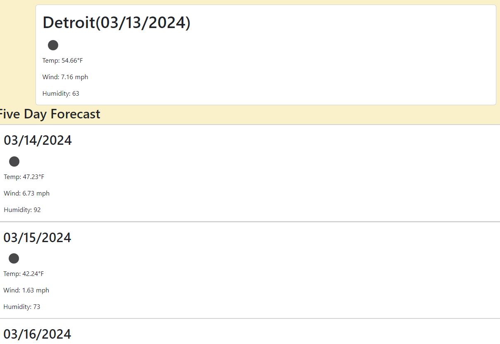

# c06-weather-dashboard

## Description

This project acts as a weather dashboard using the openweathermap api.

Working through this project has helped me feel more comfortable with JS in general,
however it's showed me that I still have a lot to learn with anything that adjust the CSS.

Disappointed with how the UI turned out, but hoping to get better at it with practice.

## Table of Contents (Optional)

N/A

## Installation

N/A

## Usage

Type in a city name and select the search button to gather weather results for the current day
and the 5 days after that. All searches are saved locally to help with additional searches.

You can check it out [here!](https://enkw.github.io/c06-weather-dashboard/)

## Credits

Bootstrap, OpenWeatherMap, jQuery, dayjs, and Bryan Lebeuf for trying as hard as he could to help me
understand the styling.

Ian Wolfe

## License

N/A

## Badges

N/A

## Features

Search for the current weather and a 5 day forecast using the search bar. All cities searched will 
be saved locally to help you navigate back previous searches.

In the future, I'd like to update this so that I can make sure the list only holds a set
number of responses.

## How to Contribute

N/A

## Tests

N/A
